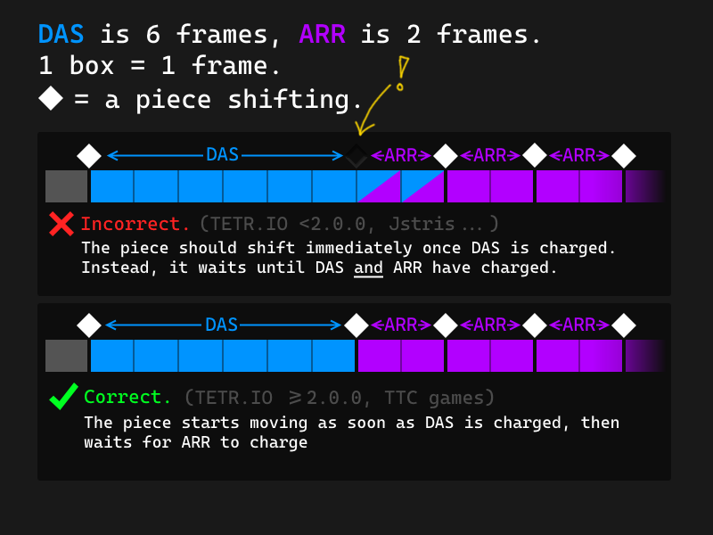

  🚧 Szerkesztés alatt, egyes részek átkerülhetnek a készülő Szótár részre. 🚧

A játék célja, hogy minél több idő alatt minél több pontot szerezzünk, mielőtt a játéktér betelne az egyre inkább felgyorsuló 4 blokkból álló tetrimino-elemekkel. Ha a játéktéren belül egy vízszintes sort kihagyás nélkül feltöltünk, az adott sor eltűnik, ez az ún. line clear, vagy sortörlés. Az e fölötti elemek egy sorral lejjebb kerülnek, átveszik a helyüket.

## A hivatalos, modern játékváltozat szabályai

  <a href="https://harddrop.com/wiki/Tetris_Guideline" class="alert-link">HardDrop Wiki</a> alapján.

A 2001 után megjelent játékok szabályait a *Tetris Company* egységesítette, ezek:

- A játéktér 10 cella széles és legalább 22 cella magas, amelyből a 20. sor fölötti cellák láthatatlanok.

- Az elemek hivatalos neve "***Tetrimino***", és az alábbi színeket és betűneveket kapták:

    - Cián I
    - Sárga O
    - Lila T
    - Zöld S
   - Piros Z
    - Kék J
    - Narancs L 

- Az I és az O középen, a többi elem eggyel balra eső oszlopban jelenik meg. A vízszintesen megjelenő J, L, és T a hosszanti oldalukon fekszenek.

- **SRS**-forgatási rendszer.

- **Véletlen-generátor**. Más néven "7-es zsák" (7 bag). A játék mind a hét tetrimino véletlenszerűen megkevert sorozatát generálja, majd kiosztja. Amint elfogy mint a hét elem, új sorozatot generál. Úgy kell elképzelni, mintha egy zsákból húznánk ki az összes elemet, majd az ismételten feltöltődne mind a hét elemmel. Legrosszabb esetben az elsőre kihúzott elem a tizenkettedik elemként kerül kihúzásra. A pontos variációk száma pedig 5040 (7 faktoriális). Az első játékokban még nem szerepelt ez a mechanika, így egy adott elem többször is előfordulhatott egymás után.

- ***Hold***. Tartogatás funkció.

- **Ghost-piece**. Lehelyezés előtt látható az adott elem "szellemképe".

- A legtöbb játék mutatja a következő három vagy öt elemet, azonban hivatalosan a számuk nincs megszabva.

### Attack table

A sztenderd ("*guideline*") *attack table* az alábbiak szerint alakul:

| Sortörlés neve: | Törölt sorok száma | Az ellenfélhez "küldött", az ellenfélnél megjelenő sorok száma. |
| --- | --- | --- |
| Egysoros | 1   | 0   |
| Dupla | 2   | 1   |
| Tripla | 3   | 2   |
| Tetris | 4   | 4   |
| T-Spin Single | 1   | 2   |
| T-Spin Double | 2   | 4   |
| T-Spin Triple | 3   | 6   |
| All Clear | 1, 2, 3, 4 | +7  |
| 1 Combo | 1, 2, 3, 4 | 0   |
| 2 vagy 3 Combo | 1, 2, 3, 4 | +1  |
| 4 vagy 5 Combo | 1, 2, 3, 4 | +2 (majd további +1 minden második kombóért) |
| Back-to-Back bónusz | 0   | +1  |

## Oldalirányú mozgás, DAS, ARR

Érdemes még szót ejtenünk az oldalirányú mozgásról, amely a következőképpen működik. Az iránygomb lenyomását követően a játék a leeső darabot oldalirányban eltolja, vár, majd ismételten eltolja, ha a játékos továbbra is nyomva tartja a billentyűt. Ezt a viselkedést a következő két értékkel lehet módosítani:

- **DAS**: Jelentése *Delayed Auto Shift*: Késleltetett automatikus csúsztatás. Az automatikus csúsztatás előtti késleltetésre utal. Magyarul azt szabályozza, hogy mennyi ideig kell lenyomni a bal vagy a jobb iránygombot, mielőtt elindulna az elem az kívánt irányba. Nagyon alacsony értéknél szinte a billentyű/gomb legkisebb érintése is már mozgásba hozza az elemet, míg magas értéknél több ideig kell lenyomva tartani. A jobb játékosok általában alacsony DAS-értéket adnak meg, így gyorsabban tudnak játszani. Jstrisen pl az alap érték 133ms, Tetr.io-n pedig 167ms/10F.
  Érdemes megjegyezni, hogy pl a Tetr.io képkockákban számol, de milliszekundum értékeket mutat (amit a jstris használ), így a jstres 133ms alapérték 8F-nek (8 képkockának) felel meg, míg a jstris-es 10 ARR =0.6F-nek.

Érdemes kísérletezni, míg megtalálja az ember a megfelelő értéket.

- **ARR**: *Auto Repeat Rate*. Automatikus ismétlési érték. Szintén vízszintes elemérzékenységet szabályoz: azt szabja meg, hogy milyen gyorsan mozog az elem balra vagy jobbra. Nagyon alacsony értéken hosszabb lenyomás esetén szinte rögtön a falhoz ütközik az adott elem, míg magas beállítás esetén csak lassan mozog a fal felé.
        Jstrisen az alap ARR 10ms (Tetr.io 2F/33ms), a megfelelő lépések elsajátítása után (lásd: finesse) érdemes minél hamarabb 0-ra állítani.

A DAS tehát több képkockán keresztül töltődik fel, amikor a játékos lenyomva tartja a bal vagy jobb iránygombot. Amint eléri a beállított értéket, az elem onnantól fogva az Auto-Repeat Rate értékét veszi figyelembe. A két legnépszerűbb ingyenes Tetris-klónban (jstris és Tetr.io) különböző módosítani működik a számolási alapelv:

- Jstris-en a gomblenyomást követően először vár a mozgás egy DAS-időszakot, majd egy ARR-időszakot, és csak ezután indítja el, ismételve az ARR értéket.

- A Tetr.io-n (és a sztenderd változatot használó játékok esetében) a gomblenyomást követően először vár egy DAS-időszakot, majd elindítja a mozgást, utána ismétlődik az ARR érték.

   

A kép az Tetr.io <a href="https://tetrio.team2xh.net/faq#handling">FAQ oldaláról</a> származik.

Néhány játékban van ARE (アレ), esetleg line-clear delay: az előbbi a következő elem megjelenését, míg a másik érték pedig a sortörlési késleltetést szabályozza.

További részleteket az egyes variánsok alatt találsz.

## Leggyakoribb játékmódok:

- Score Attack
- Sprint
- Ultra
- Cheese Race
